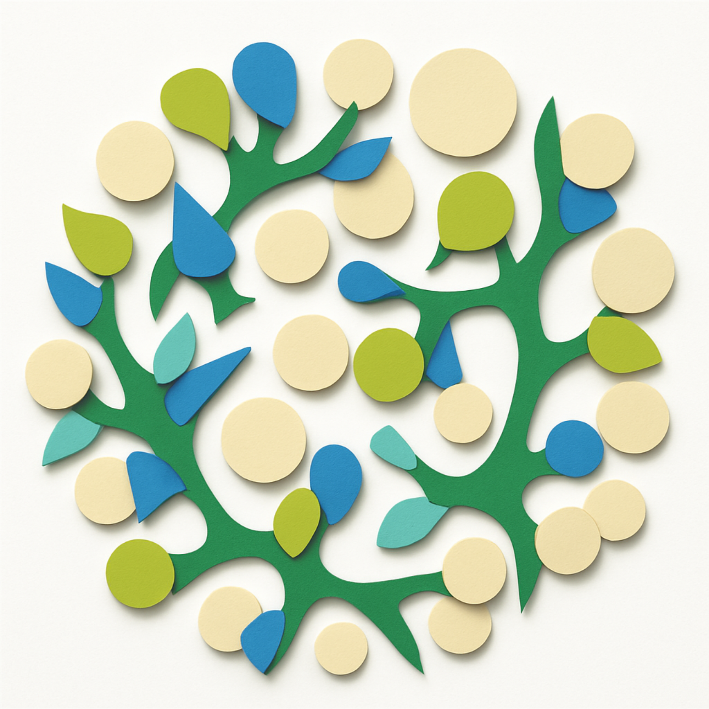
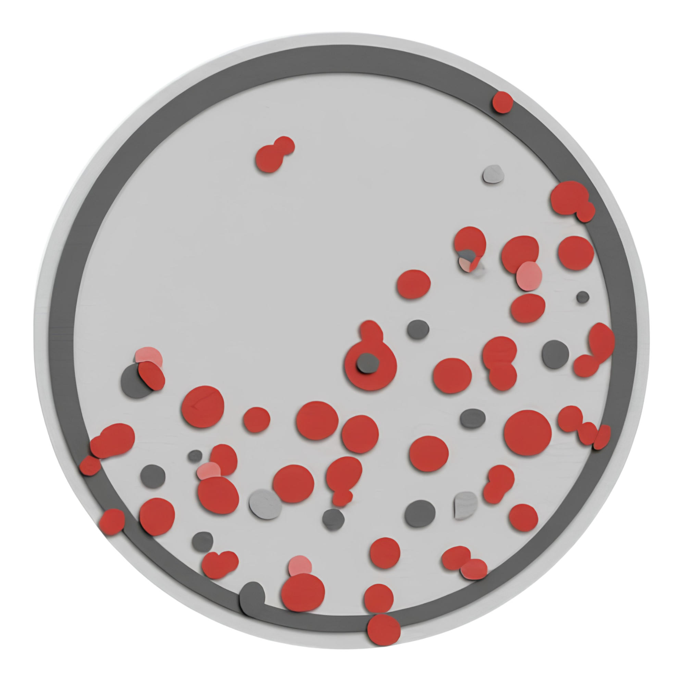

Below are featured courses with links and each site’s favicon/logo. Click any card title or the **Visit Course** button to open the course website.

```{=html}
<div class="course-grid">

  <!-- MB 360 -->
  <div class="course-card">
    <div class="course-card-body">
      <h2 class="course-title">
        <a href="https://go.ncsu.edu/mb360" target="_blank" rel="noopener">
          Microbiology | MB 360
        </a>
      </h2>
      <p class="course-meta">NC State University · Department of Biological Sciences</p>
      <p class="course-desc">
        An introductory microbiology course exploring the diversity, physiology, genetics, and
        ecological roles of microorganisms, with an emphasis on active learning and discovery.
      </p>
      <a class="course-btn" href="https://go.ncsu.edu/mb360" target="_blank" rel="noopener">
        Visit Course ↗
      </a>
    </div>
    <div class="course-logo">
      <a href="https://go.ncsu.edu/mb360" target="_blank" rel="noopener" aria-label="Open MB 360 course website">
        
      </a>
    </div>
  </div>

  <!-- Microbial Superheroes / Delftia Book -->
  <div class="course-card">
    <div class="course-card-body">
      <h2 class="course-title">
        <a href="https://go.ncsu.edu/delftiabook" target="_blank" rel="noopener">
          Microbial Superheroes | LSC 170
        </a>
      </h2>
      <p class="course-meta">NC State University · Department of Biological Sciences</p>
      <p class="course-desc">
        A course built around an open educational resource (the <em>Delftia</em> book) that
        engages students in exploring microbial superpowers—from gold biomineralization to
        antibiotic resistance—through collaborative, inquiry-driven learning.
      </p>
      <a class="course-btn" href="https://go.ncsu.edu/delftiabook" target="_blank" rel="noopener">
        Visit Course ↗
      </a>
    </div>
    <div class="course-logo">
      <a href="https://go.ncsu.edu/delftiabook" target="_blank" rel="noopener" aria-label="Open Microbial Superheroes course website">
        
      </a>
    </div>
  </div>

  <!-- MyCOED -->
  <div class="course-card">
    <div class="course-card-body">
      <h2 class="course-title">
        <a href="https://go.ncsu.edu/mycoed" target="_blank" rel="noopener">
          MyCOED
        </a>
      </h2>
      <p class="course-meta">NC State University</p>
      <p class="course-desc">
        An open educational resource and course companion focused on microbiology concepts
        and evidence-based pedagogies, supporting instructors and students through
        collaborative, community-driven content.
      </p>
      <a class="course-btn" href="https://go.ncsu.edu/mycoed" target="_blank" rel="noopener">
        Visit Course ↗
      </a>
    </div>
    <div class="course-logo">
      <a href="https://go.ncsu.edu/mycoed" target="_blank" rel="noopener" aria-label="Open MyCOED course website">
        
      </a>
    </div>
  </div>

</div>
```
