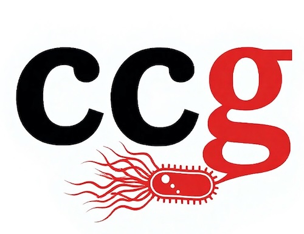

::: {.home-shell}
::: {.home-hero}
::: {.home-hero-orb .home-hero-orb-one}
:::
::: {.home-hero-orb .home-hero-orb-two}
:::

::: {.home-hero-text}

NC State · Microbiology · Teaching · Mentoring

  

    {.home-brand-mark fig-alt="CCG monogram logo"}
  

  

# Carlos C. Goller {.home-name}

Teaching Professor · North Carolina State University

  

Microbiologist, educator, and mentor connecting evidence-based teaching with authentic scientific discovery at NC State.

Explore scholarship, teaching, mentoring, and course innovation through a clear, modern academic homepage designed to highlight impact and make professional resources easy to find.

::: {.profile-buttons role="navigation" aria-label="Homepage quick links"}
<a href="research.qmd" class="profile-button profile-button-primary">Explore Research</a>
<a href="publications.qmd" class="profile-button">Publications</a>
<a href="teaching.qmd" class="profile-button">Teaching</a>
<a href="mentoring.qmd" class="profile-button">Mentoring</a>
<a href="contact.qmd" class="profile-button">Connect</a>
:::

<a href="https://linkedin.com/in/ccgoller">LinkedIn</a> · <a href="https://github.com/ccgoller">GitHub</a> · <a href="cv.qmd">CV</a>

:::

::: {.home-hero-media}
{.home-portrait fig-alt="Portrait of Carlos C. Goller"}
:::
:::

::: {.home-cta-band}
::: {.home-cta-copy}
## Advancing science, teaching, and student growth

A professional academic site for research, mentoring, publications, course innovation, and practical teaching resources.
:::
::: {.home-cta-actions role="navigation" aria-label="Primary homepage actions"}
<a href="cv.qmd" class="home-cta-button home-cta-button-primary">View CV</a>
<a href="contact.qmd" class="home-cta-button">Contact</a>
:::
:::

::: {.home-stat-band}
::: {.home-stat}

77+

Scholarly works

:::
::: {.home-stat}

70+

Students mentored

:::
::: {.home-stat}

12+

Years at NC State

:::
::: {.home-stat}

4

Active course sites

:::
:::

::: {.home-section aria-labelledby="featured-areas-heading"}
## Featured Areas {#featured-areas-heading}

::: {.home-card-grid}
::: {.home-card .home-card-accent-research}
### Research

Microbial physiology, metabolism, pathogenesis, and research-rich scholarship creating authentic discovery opportunities for students.

[Explore research](research.qmd)
:::

::: {.home-card .home-card-accent-publications}
### Publications

Peer-reviewed articles, education scholarship, and collaborative work across microbiology, teaching, and interdisciplinary science.

[View publications](publications.qmd)
:::

::: {.home-card .home-card-accent-teaching}
### Teaching

Inclusive, inquiry-driven pedagogy that connects scientific concepts with authentic practice and student engagement.

[See teaching](teaching.qmd)
:::

::: {.home-card .home-card-accent-mentoring}
### Mentoring

Mentoring and professional growth work that supports learner success at every stage of scientific development.

[Explore mentoring](mentoring.qmd)
:::
:::
:::

::: {.home-section aria-labelledby="explore-site-heading"}
## Explore the Site {#explore-site-heading}

::: {.home-link-grid role="navigation" aria-label="Explore the site"}
<a href="courses.qmd" class="home-link-card">Courses</a>
<a href="professional-development.qmd" class="home-link-card">Professional Development</a>
<a href="cv.qmd" class="home-link-card">Curriculum Vitae</a>
<a href="contact.qmd" class="home-link-card">Contact</a>
<a href="https://ccgoller.github.io/bsc-fungal-genomics-lab/" class="home-link-card">BSC 495: The Hidden World's Code</a>
<a href="https://ccgoller.github.io/mb360workbook/" class="home-link-card">MB 360: Microbial Metabolism</a>
:::
:::
:::
