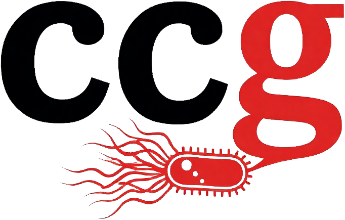

  <section class="home-hero home-hero-simple">
    

      
NC State · Microbiology · Teaching · Mentoring

      

        
        

          <h1 class="home-name">Carlos C. Goller</h1>
          
Teaching Professor · North Carolina State University

        

      

      
Microbiologist, educator, and mentor connecting evidence-based teaching with authentic scientific discovery at NC State.

      
Explore scholarship, teaching, mentoring, and course innovation through a clear, modern academic homepage designed to highlight impact and make professional resources easy to find.

      

        <a href="research.qmd" class="profile-button profile-button-primary">Explore Research</a>
        <a href="publications.qmd" class="profile-button">Publications</a>
        <a href="teaching.qmd" class="profile-button">Teaching</a>
        <a href="mentoring.qmd" class="profile-button">Mentoring</a>
        <a href="contact.qmd" class="profile-button">Connect</a>
      

      
<a href="https://linkedin.com/in/ccgoller">LinkedIn</a> · <a href="https://github.com/ccgoller">GitHub</a> · <a href="cv.qmd">CV</a>

    

  </section>

  <section class="home-cta-band">
    

      <h2>Advancing science, teaching, and student growth</h2>
      
A professional academic site for research, mentoring, publications, course innovation, and practical teaching resources.

    

    

      <a href="cv.qmd" class="home-cta-button home-cta-button-primary">View CV</a>
      <a href="contact.qmd" class="home-cta-button">Contact</a>
    

  </section>

  <section class="home-stat-band" aria-label="Homepage highlights">
    

      
77+

      
Scholarly works

    

    

      
70+

      
Students mentored

    

    

      
12+

      
Years at NC State

    

    

      
4

      
Active course sites

    

  </section>

  <section class="home-section" aria-labelledby="featured-areas-heading">
    <h2 id="featured-areas-heading">Featured Areas</h2>
    

      <section class="home-card home-card-accent-research">
        <h3>Research</h3>
        
Microbial physiology, metabolism, pathogenesis, and research-rich scholarship creating authentic discovery opportunities for students.

        
<a href="research.qmd">Explore research</a>

      </section>
      <section class="home-card home-card-accent-publications">
        <h3>Publications</h3>
        
Peer-reviewed articles, education scholarship, and collaborative work across microbiology, teaching, and interdisciplinary science.

        
<a href="publications.qmd">View publications</a>

      </section>
      <section class="home-card home-card-accent-teaching">
        <h3>Teaching</h3>
        
Inclusive, inquiry-driven pedagogy that connects scientific concepts with authentic practice and student engagement.

        
<a href="teaching.qmd">See teaching</a>

      </section>
      <section class="home-card home-card-accent-mentoring">
        <h3>Mentoring</h3>
        
Mentoring and professional growth work that supports learner success at every stage of scientific development.

        
<a href="mentoring.qmd">Explore mentoring</a>

      </section>
    

  </section>

  <section class="home-section" aria-labelledby="explore-site-heading">
    <h2 id="explore-site-heading">Explore the Site</h2>
    

      <a href="courses.qmd" class="home-link-card">Courses</a>
      <a href="professional-development.qmd" class="home-link-card">Professional Development</a>
      <a href="cv.qmd" class="home-link-card">Curriculum Vitae</a>
      <a href="contact.qmd" class="home-link-card">Contact</a>
      <a href="https://ccgoller.github.io/bsc-fungal-genomics-lab/" class="home-link-card">BSC 495: The Hidden World's Code</a>
      <a href="https://ccgoller.github.io/mb360workbook/" class="home-link-card">MB 360: Microbial Metabolism</a>
    

  </section>

